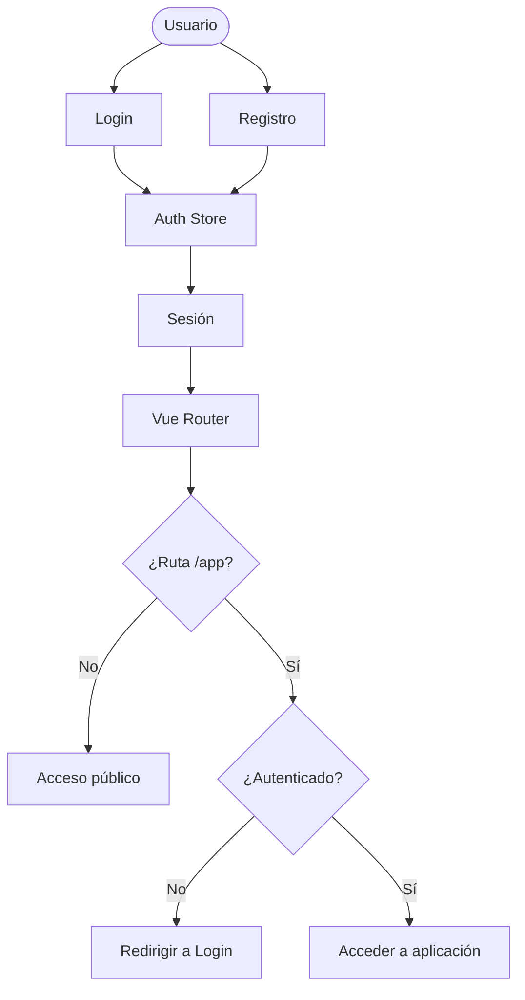
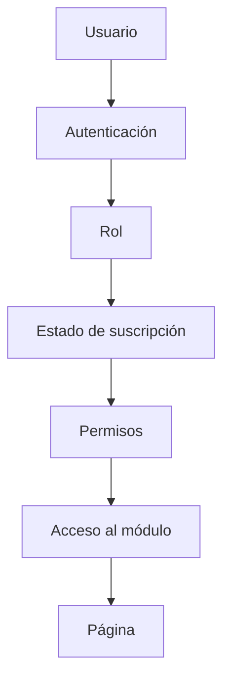
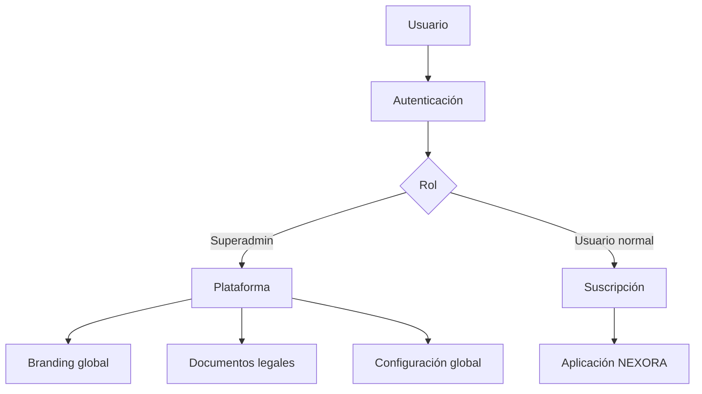
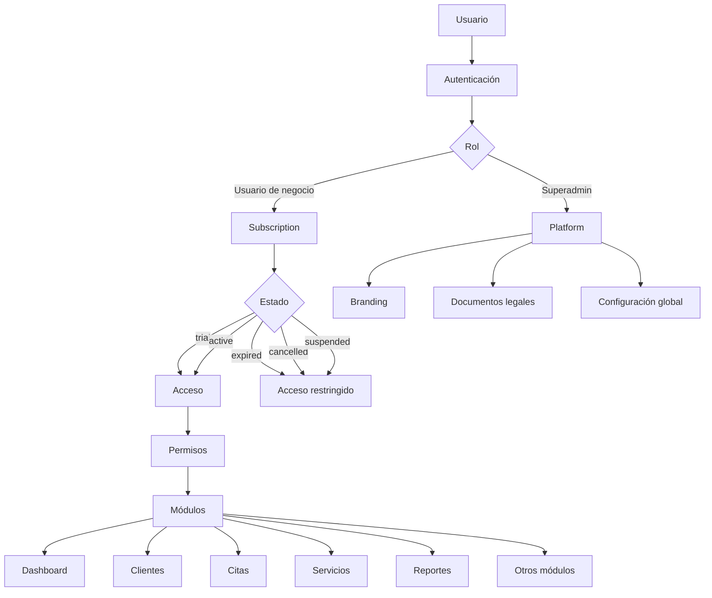

# NEXORA — Autenticación, roles y acceso

## Flujo actual




## Router Guard actual

La protección actual funciona conceptualmente así:

```text
Usuario
   │
   ▼
Router
   │
   ▼
restaurarSesion()
   │
   ▼
¿Ruta empieza por /app?
   │
   ├── NO ──► continuar
   │
   └── SÍ
          │
          ▼
     ¿Autenticado?
          │
          ├── NO ──► /auth/login
          │
          └── SÍ ──► permitir acceso
```


## Redirección al Login

Cuando un usuario no autenticado intenta acceder a:

```text
/app/dashboard
```

el router genera:

```text
/auth/login?redirect=/app/dashboard
```

Esto permite conservar la ruta que el usuario intentaba visitar.


## Usuario autenticado

Si un usuario autenticado intenta acceder a:

```text
/auth/login
```

el router actualmente lo envía a:

```text
/app/dashboard
```


# Próxima arquitectura de autorización

La arquitectura prevista para NEXORA será:




## Capas de acceso

### 1. Autenticación

Determina:

```text
¿El usuario inició sesión?
```

Ejemplo:

```text
autenticado = true
```


### 2. Rol

Determina:

```text
¿Qué tipo de usuario es?
```

Ejemplos previstos:

```text
superadmin
admin
manager
employee
user
```


### 3. Suscripción

Determina:

```text
¿La cuenta puede utilizar NEXORA?
```

Estados previstos:

```text
trial
active
expired
cancelled
suspended
```


### 4. Permisos

Determina:

```text
¿Qué puede hacer el usuario?
```

Ejemplo conceptual:

```text
appointments.view
appointments.create
appointments.edit
appointments.delete
customers.view
customers.create
reports.view
```


## Superadministrador

La Plataforma será una zona especial:



El objetivo es que:

```text
Superadmin
   ↓
Plataforma
```

no dependa de la suscripción normal de un negocio.


## Arquitectura final prevista




# Estado de implementación

## Implementado


## Siguiente fase

