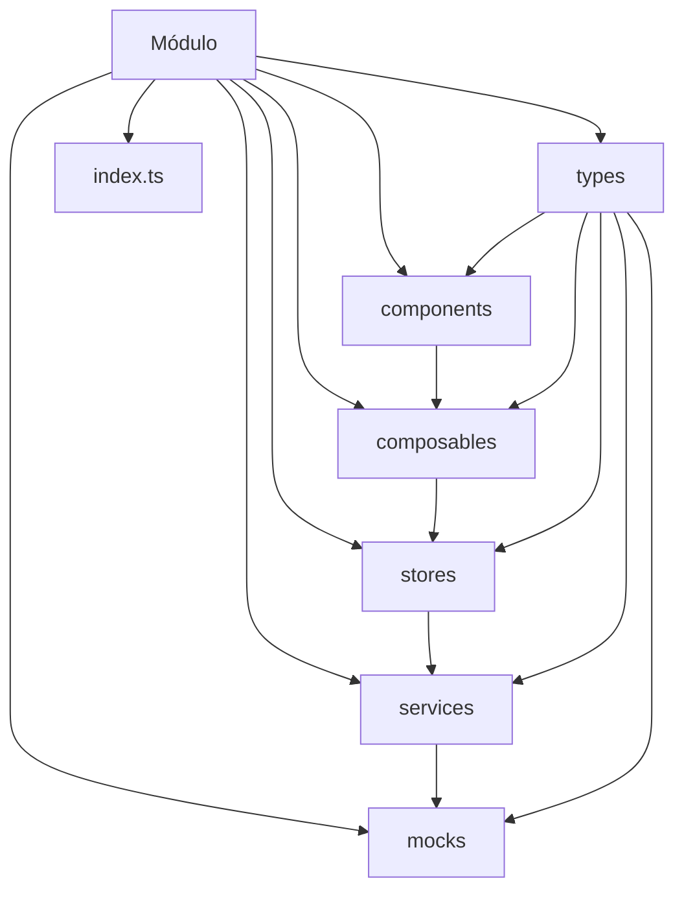
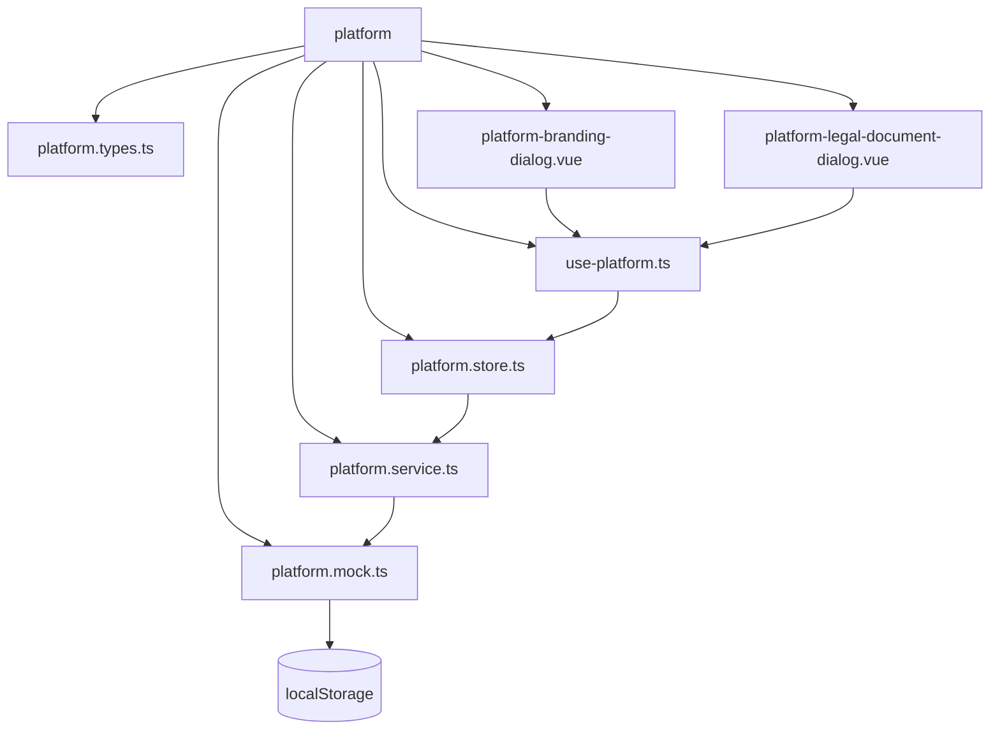
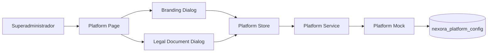
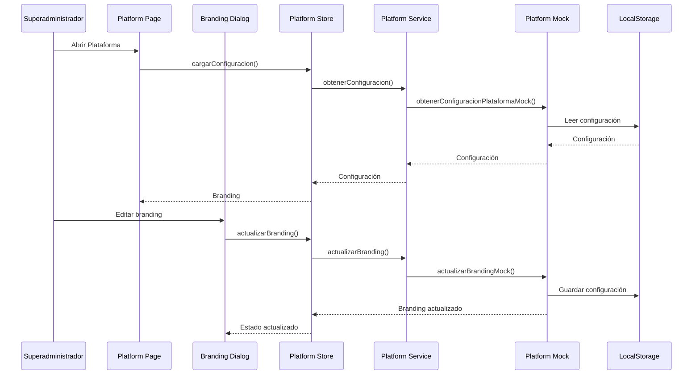
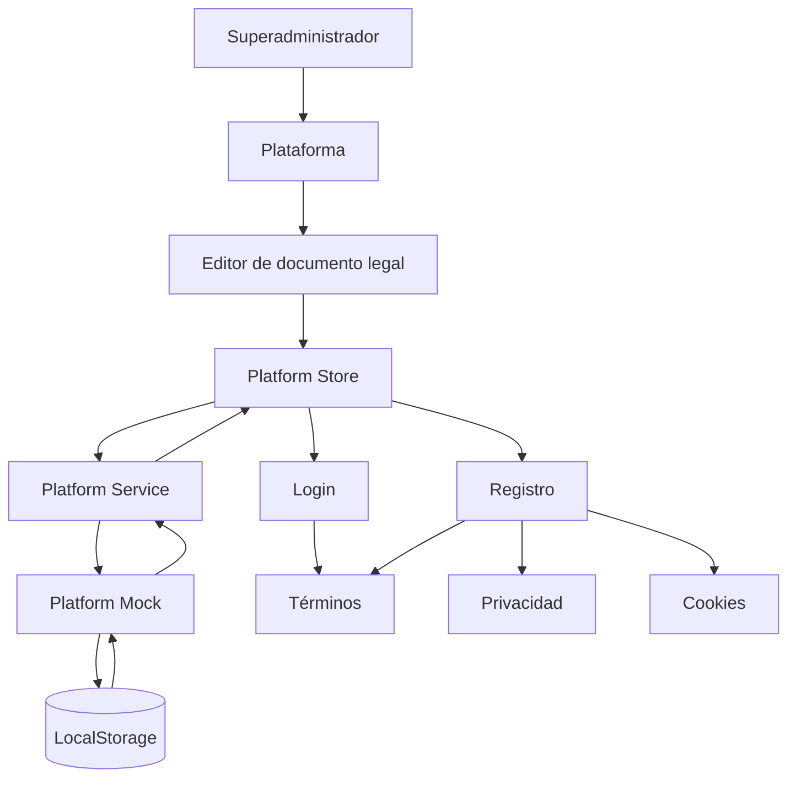

# NEXORA — Arquitectura frontend

## Arquitectura general

NEXORA utiliza una arquitectura modular basada en:


La arquitectura está preparada para reemplazar posteriormente los mocks por una API/backend real.


## Flujo general de datos

```mermaid
flowchart TD

    PAGE[Page / Vista]
        --> COMPONENT[Componentes]

    COMPONENT
        --> COMPOSABLE[Composable]

    COMPOSABLE
        --> STORE[Pinia Store]

    STORE
        --> SERVICE[Service]

    SERVICE
        --> MOCK[Mock actual]
| whatsapp | Si | Si | Si | Si | Si | Si |

    MOCK
        --> STORAGE[(LocalStorage)]

    SERVICE -. Futuro .-> API[API Backend]

    API -. Futuro .-> DATABASE[(Base de datos)]
```


## Arquitectura por módulo




## Ejemplo: módulo Platform




## Platform — configuración




## Flujo de Branding




## Flujo de documentos legales




## Preparación para backend

Actualmente:

```text
Vue
 ↓
Composable
 ↓
Pinia
 ↓
Service
 ↓
Mock
 ↓
LocalStorage
```

Arquitectura futura:

```text
Vue
 ↓
Composable
 ↓
Pinia
 ↓
Service
 ↓
API
 ↓
Backend
 ↓
Database
```

El objetivo es que los componentes y composables no tengan que conocer directamente la implementación del backend.


## Principio de separación

```text
Component
    ↓
Presentación

Composable
    ↓
Lógica reutilizable

Store
    ↓
Estado global

Service
    ↓
Acceso a datos

Mock/API
    ↓
Persistencia
```

Esto permite reemplazar:

```text
platform.mock.ts
```

por una implementación HTTP posteriormente sin tener que reconstruir todo el módulo de Platform.
