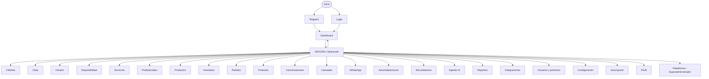
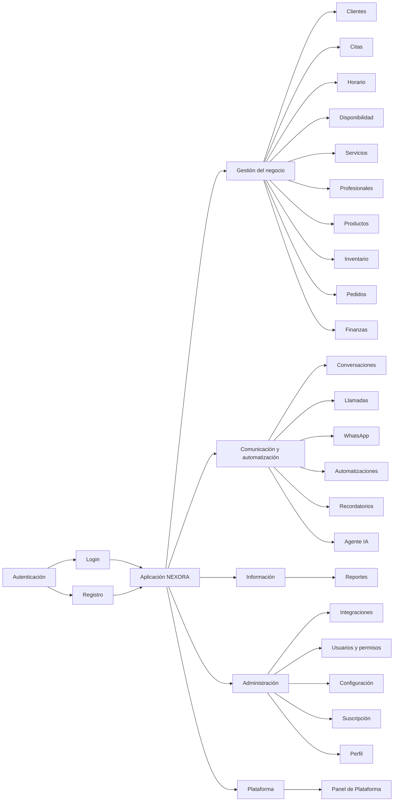
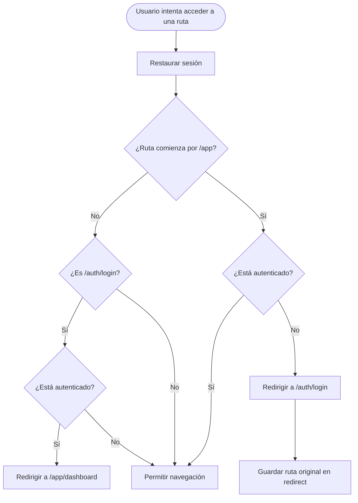

# NEXORA — Flujo de navegación

Este documento representa la navegación actual de NEXORA.

## Flujo principal




## Rutas públicas

```text
/
├── /
├── /auth/login
└── /auth/register
```

### Login

```text
/auth/login
      │
      ├── Usuario no autenticado
      │        │
      │        └── Puede iniciar sesión
      │
      └── Usuario autenticado
               │
               └── /app/dashboard
```

### Registro

```text
/auth/register
      │
      └── Crear cuenta
             │
             └── /app/dashboard
```


## Rutas protegidas

Todas las rutas que comienzan por:

```text
/app
```

requieren autenticación.

Actualmente existen:

```text
/app
/app/dashboard

/app/appointments
/app/customers
/app/schedule
/app/availability
/app/services
/app/employees

/app/products
/app/inventory
/app/orders
/app/finance

/app/conversations
/app/calls
/app/whatsapp
/app/automations
/app/reminders
/app/ai

/app/reports
/app/integrations

/app/users
/app/settings
/app/subscription
/app/profile

/app/platform
```


## Estructura conceptual




## Flujo de redirección

El router actualmente implementa estas reglas:




## Estado actual de protección

Actualmente el router protege:

```text
/app/*
```

mediante autenticación.

Todavía quedan como siguientes capas:

```text
Autenticación
      ↓
Rol
      ↓
Suscripción
      ↓
Permisos del módulo
```

Estas capas serán implementadas posteriormente.


## Nota técnica

NEXORA utiliza Vue Router Auto Routes.

Las rutas se generan automáticamente desde:

```text
src/pages/
```

Por esta razón:

```text
src/router/routes.ts
```

no contiene manualmente cada ruta.

No modificar manualmente:

```text
typed-router.d.ts
```

porque es un archivo generado por Vue Router.
